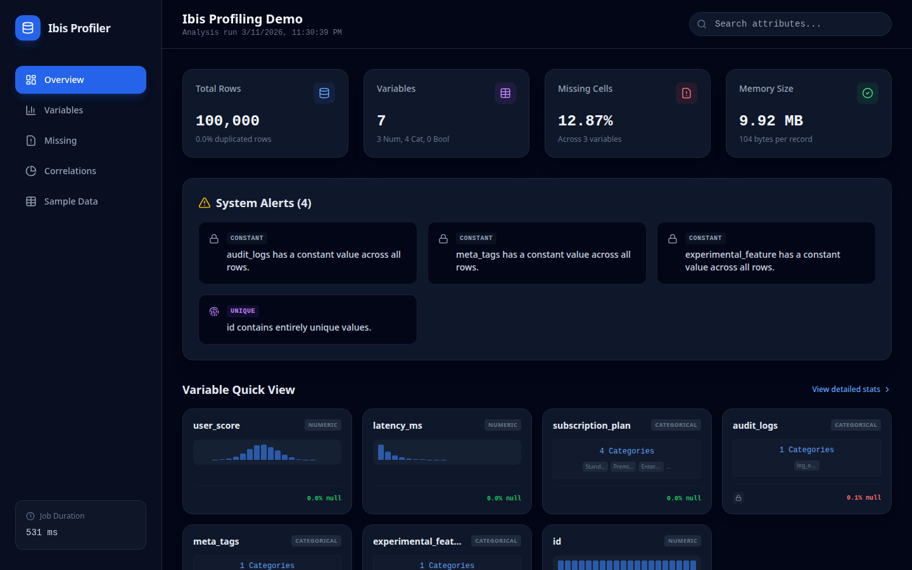
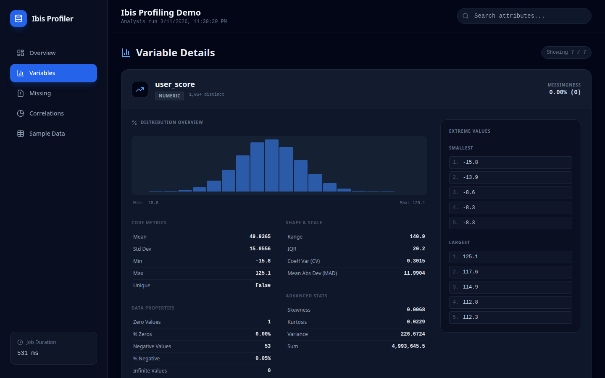
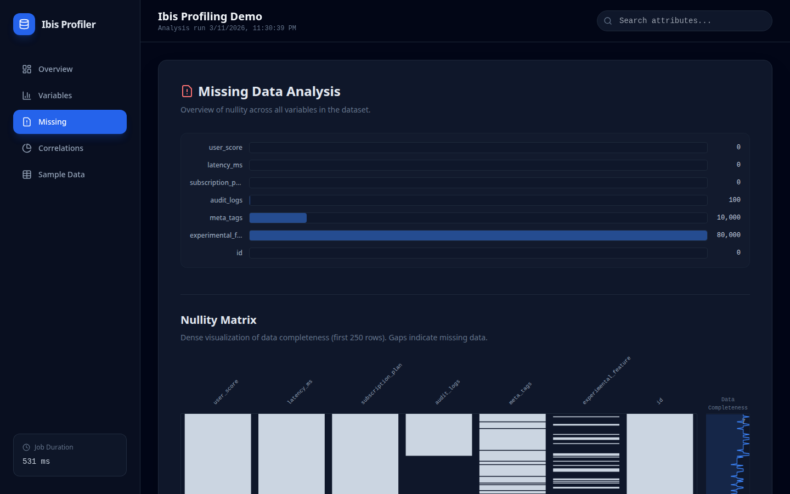

<p align="center">
  
</p>

# Ibis Profiling

An ultra-high-performance data profiling system built natively for **Ibis**.

## Core Principle: Profiling as Query Compilation

Unlike traditional profiling tools (e.g., `ydata-profiling`) that iterate over columns or load data into local memory (Pandas), **Ibis Profiling** treats profiling as a **query planning problem**. 

It compiles dozens of statistical metrics into a **minimal set of optimized SQL queries** that execute directly in your remote backend (DuckDB, BigQuery, Snowflake, ClickHouse, etc.). This ensures that computation happens where the data lives, enabling the profiling of multi-billion row datasets in seconds rather than hours.

---

## 🖼️ Preview

### Overview Dashboard


### Variable Analysis


### Missing Values (Matrix & Heatmap)


---

## 🚀 Key Features

- **Backend Pushdown:** 100% of the heavy lifting is done by the database engine.
- **Multi-Pass Execution:** Intelligently splits computation into optimized passes to handle complex moments (Skewness, MAD) without backend "nested aggregation" errors.
- **JSON Schema Parity:** Achieves full structural and statistical parity with `ydata-profiling`, allowing drop-in replacement for downstream automated pipelines.
- **High-Fidelity SPA:** Generates a modern Single Page Application (SPA) report with interactive Plotly charts, SVG-based nullity matrices, and alert badges.
- **Excel Support:** Directly profile Excel files (.xlsx, .xls, .xlsb) using high-performance Rust-based parsing.
- **Scalability:** Profile **10 million rows in < 25 seconds** (Full mode) and **20 million rows in < 50 seconds** (Minimal mode).

---

## 🛡️ Backend Stability & NaN Handling

A critical challenge in database-native profiling is the handling of `NaN` (Not-a-Number) values in floating-point columns. Traditional database aggregations (like `STDDEV_SAMP` in DuckDB) often throw `OutOfRange` errors when encountering `NaN`s.

**Ibis Profiling** implements a **Safe-Aggregation** layer that automatically treats `NaN` values as `NULL` during statistical computation. This ensures:
1. **Zero Crash Policy:** Profiles complete successfully even on messy synthetic or sensor data.
2. **Mathematical Consistency:** Statistics (mean, std, variance) are computed on the subset of valid numeric values, matching the behavior of high-level tools like Pandas while staying within the database.

---

## 📈 Performance Benchmarks

Benchmarks were conducted using a synthetic dataset with 20 columns (mix of numeric, categorical, text, and boolean) on a standard Linux environment using the **DuckDB** backend.

| Dataset Size | Ibis (Min) | Ibis (Full) | ydata (Min) | ydata (Full) | Mem Ibis (Min) | Mem ydata (Min) | Mem Ibis (Full) | Mem ydata (Full) |
| :--- | :--- | :--- | :--- | :--- | :--- | :--- | :--- | :--- |
| **10k Rows** | 0.89s | 1.40s | 9.94s | 28.38s | ~2.4 MB | ~74 MB | ~4.5 MB | ~107 MB |
| **25k Rows** | 1.03s | 1.57s | 12.20s | 30.47s | ~2.1 MB | ~154 MB | ~4.4 MB | ~188 MB |
| **50k Rows** | 1.22s | 1.82s | 16.63s | 35.10s | ~2.0 MB | ~284 MB | ~4.4 MB | ~324 MB |
| **500k Rows** | 2.29s | 3.56s | 91.93s | ~3m (est) | ~2.0 MB | ~2.5 GB | ~4.4 MB | ~2.8 GB (est) |
| **1M Rows** | 3.14s | 5.44s | 166.31s | ~6m (est) | ~2.1 MB | ~4.9 GB | ~4.4 MB | ~5.3 GB (est) |
| **5M Rows** | 10.69s | 17.88s | ~14m (est) | ~45m (est) | ~2.0 MB | >20 GB (est) | ~4.4 MB | >25 GB (est) |
| **10M Rows** | 20.64s | 21.29s* | ~28m (est) | ~1.5h (est) | ~2.4 MB | >40 GB (est) | ~2.6 MB* | >50 GB (est) |
| **20M Rows** | 43.98s | 8.77s** | >1h (est) | >3h (est) | ~2.4 MB | >80 GB (est) | ~1.0 MB** | >100 GB (est) |

*Notes:
- 10M Full (21.29s) used 10 columns.
- 20M Full (8.77s) used 5 columns.
- All other benchmarks use 20 columns.
- Ibis memory usage is nearly constant and extremely low compared to ydata-profiling due to database-native pushdown.*

### 🔍 Estimation Methodology
Projections for `ydata-profiling` on larger datasets are derived from observed scaling trends:
- **Time (Minimal):** Scaled linearly based on the jump from 500k (92s) to 1M (166s) rows.
- **Time (Full):** Scaled with a factor of ~2.5x - 3x over Minimal mode, consistent with small-sample ratios.
- **Memory:** Scaled linearly based on observed peak usage (~2.5 GB at 500k, ~4.9 GB at 1M), reflecting the overhead of loading the full dataset into Pandas DataFrames.

---

## 🛠 Installation

```bash
uv add ibis-profiling
```

---

## 💻 Usage


### Quick Start (ydata-style API)

```python
import ibis
from ibis_profiling import ProfileReport

# 1. Connect to any Ibis-supported backend
con = ibis.duckdb.connect()
table = con.read_parquet("large_dataset.parquet")

# 2. Generate the report with custom title
report = ProfileReport(table, title="Loan Analysis Report")

# 3. Export results
report.to_file("report.html")
```

### Excel Ingestion

```python
from ibis_profiling import ProfileReport

# Directly profile Excel files with high-performance parsing
report = ProfileReport.from_excel("data.xlsx")
report.to_file("excel_report.html")
```

### Advanced Usage

```python
from ibis_profiling import profile

# Get the raw description dictionary
report = profile(table)
stats = report.to_dict()

print(f"Dataset Skewness: {stats['variables']['income']['skewness']}")
```

### Minimal vs. Full Profiling

The `ProfileReport` supports a `minimal` flag (default `False`) to toggle between fast exploratory profiling and deep statistical analysis.

| Feature | Minimal Mode (`minimal=True`) | Full Mode (`minimal=False`) |
| :--- | :--- | :--- |
| **Core Stats** | Count, Mean, Std, Min/Max, Zeros, Nullity. | All Minimal stats. |
| **Table Metadata** | Estimated Memory/Record Size. | Same as Minimal. |
| **Advanced Moments** | Skipped. | Skewness, Kurtosis, MAD. |
| **Correlations** | Skipped. | Pearson and Spearman matrices. |
| **Advanced Analysis** | Skipped. | Extreme Values, Monotonicity, Text Lengths. |
| **Visualizations** | Summary only. | Nullity Matrix (SVG) and Heatmap. |
| **Duplicates** | Skipped. | Dataset-wide duplicate row count. |
| **Performance** | **Ultra-Fast.** Recommended for datasets > 50M rows. | **Detailed.** Recommended for deep data quality audits. |

## Feature Gaps & Roadmap

`ibis-profiling` is designed for scale, prioritizing metrics that can be pushed down to SQL engines. As a result, some "linguistic" or high-complexity features from `ydata-profiling` are currently missing or implemented as approximations:

1.  **Linguistic Analysis:** Unicode script detection and character-level distributions are missing (require complex UDFs).
2.  **Advanced Correlations:** `phi_k`, `kendall`, and `cramers_v` are currently placeholders (higher computational complexity).
3.  **Interactions:** Pairwise scatter plot data is not yet generated.
4.  **Memory Footprint:** While Ibis uses backend-specific commands (like DuckDB's `PRAGMA storage_info`) where possible, it falls back to schema-based estimation for others.
5.  **Tail Sample:** Ibis does not provide a reliable `tail()` without an explicit ordering key; only `head()` is captured.

---

## 🏗 Architecture

The system is decoupled into five core modules:
1. **Dataset Inspector:** Zero-execution schema analysis.
2. **Metric Registry:** Declarative metric definitions as Ibis expressions.
3. **Query Planner:** The "compiler" that batches compatible expressions into minimal execution plans.
4. **Execution Engine:** Multi-pass dispatcher that handles simple vs. complex aggregations.
5. **Report Builder:** Aggregates and formats raw backend results into high-fidelity JSON/HTML following the canonical YData schema.

---

## 📊 Missing Values Analysis

Move beyond simple counts with advanced pattern detection:
- **Matrix:** A vertical sparkline grid (SVG) visualizing the location of missing values across rows.
- **Heatmap:** Pearson correlation of "nullity" between variables, revealing structural dependencies.

---

## 📏 Metrics & Calculation Reference

This section provides a detailed breakdown of how metrics are calculated and how the alert engine identifies potential data quality issues.

### 1. Variable Calculations

The profiler uses a multi-pass execution engine to compute statistics efficiently across massive datasets while remaining compatible with SQL-based backends (like DuckDB).

#### Core Statistics (Pass 1)
These are computed in a single global aggregation pass using Ibis primitives.

| Metric | Calculation | Type |
| :--- | :--- | :--- |
| `n` | Total number of observations (rows) in the table. | All |
| `n_missing` | Count of `NULL` or `NaN` values. | All |
| `p_missing` | `n_missing / n` | All |
| `n_distinct` | Count of unique values (excluding `NULL`). | All |
| `p_distinct` | `n_distinct / n` | All |
| `count` | `n - n_missing` (Total non-missing values) | All |
| `mean` | `sum(x) / count` (NaNs treated as NULL) | Numeric |
| `std` | Sample standard deviation (Bessel's correction). | Numeric |
| `variance` | `std^2` | Numeric |
| `min` / `max` | Minimum and maximum values. | Numeric, DateTime |
| `zeros` | Count of values exactly equal to `0`. | Numeric |
| `n_negative` | Count of values `< 0`. | Numeric |
| `infinite` | Count of `+/- inf` values (Float only). | Numeric |

#### Advanced Statistics (Pass 2)
To avoid "Nested Aggregation" errors in SQL backends, these are computed using values from Pass 1 as constants.

| Metric | Calculation | Logic |
| :--- | :--- | :--- |
| `skewness` | `mean( ((x - μ) / σ)^3 )` | Standardized 3rd moment. |
| `mad` | `mean( abs(x - μ) )` | Mean Absolute Deviation. |
| `duplicates` | `n - count(distinct_rows)` | Dataset-wide duplicate row count. |

#### Quantiles
Calculated via `col.quantile(p)`.
- `5%`, `25%` (Q1), `50%` (Median), `75%` (Q3), `95%`.

---

### 2. Alert Engine Logic

The built-in alert engine scans the calculated metrics and triggers warnings based on industry-standard thresholds (aligned with `ydata-profiling`).

| Alert Type | Logic / Threshold | Severity |
| :--- | :--- | :--- |
| **CONSTANT** | `n_distinct == 1` | warning |
| **UNIQUE** | `n_distinct == n` | warning |
| **HIGH_CARDINALITY** | `p_distinct > 0.5` (and not `UNIQUE`, Categorical only) | warning |
| **MISSING** | `p_missing > 0.05` | info |
| **ZEROS** | `p_zeros > 0.10` | info |
| **SKEWED** | `abs(skewness) > 20` | info |

**Suppression Rules:**
1. If a column is **CONSTANT**, all other alerts for that column are suppressed.
2. If a column is **UNIQUE**, the **HIGH_CARDINALITY** alert is suppressed.
